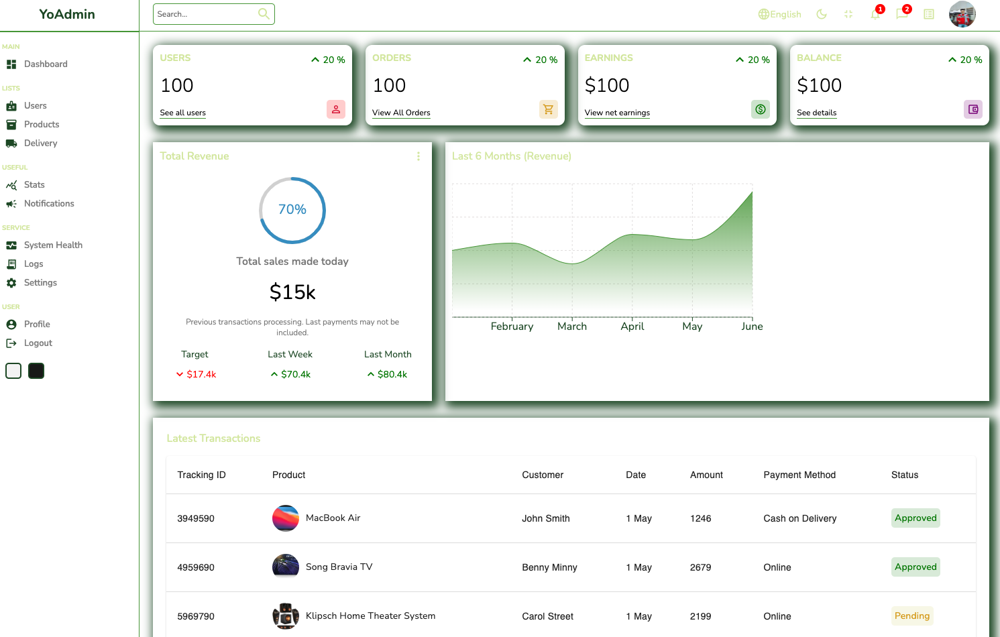
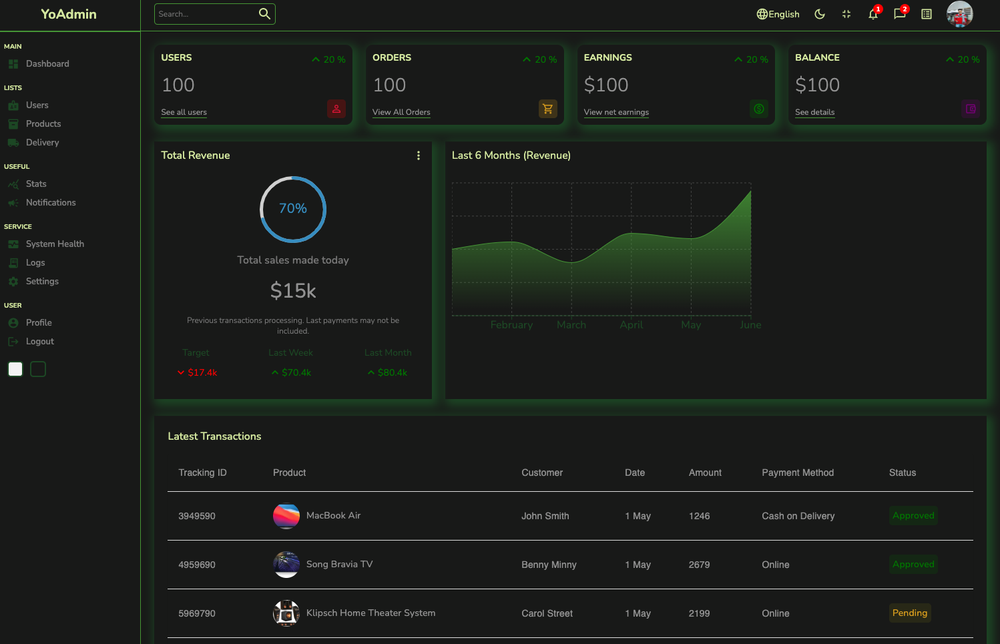
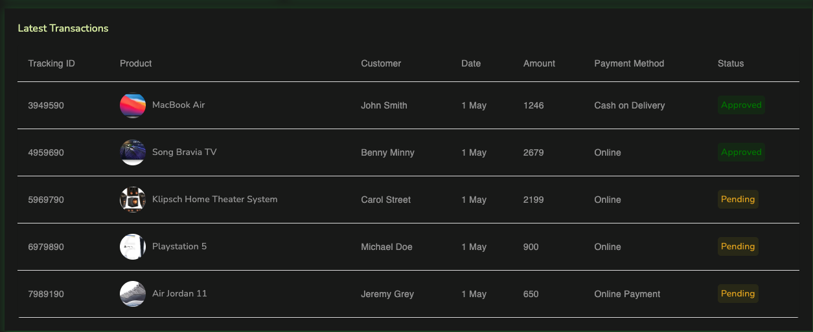
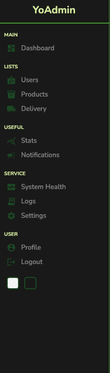

# react YoAdmin

A complex react administration app, that features users, products, revenue, and light mode/dark mode.

Final App deploy: https://slacken-1.web.app

<h1>Light Mode</h1>
  
  <h1>Dark Mode</h1>
  
  <h1>Product Table</h1>
  
  <h1>Sidebar</h1>
    
    <h1>User Page</h1>
      
      <h1>Add User</h1>
      

## Features

REACT

REDUX

CONTEXT PROVIDER

REACT ROUTER

MATERIAL UI ICONS

MATERIAL UI DATA TABLE

REACT CHARTS

SASS

HOSTINGER
